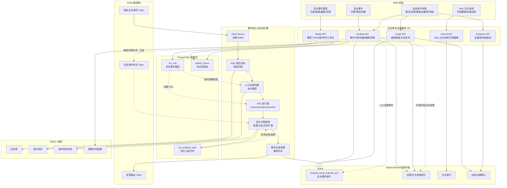
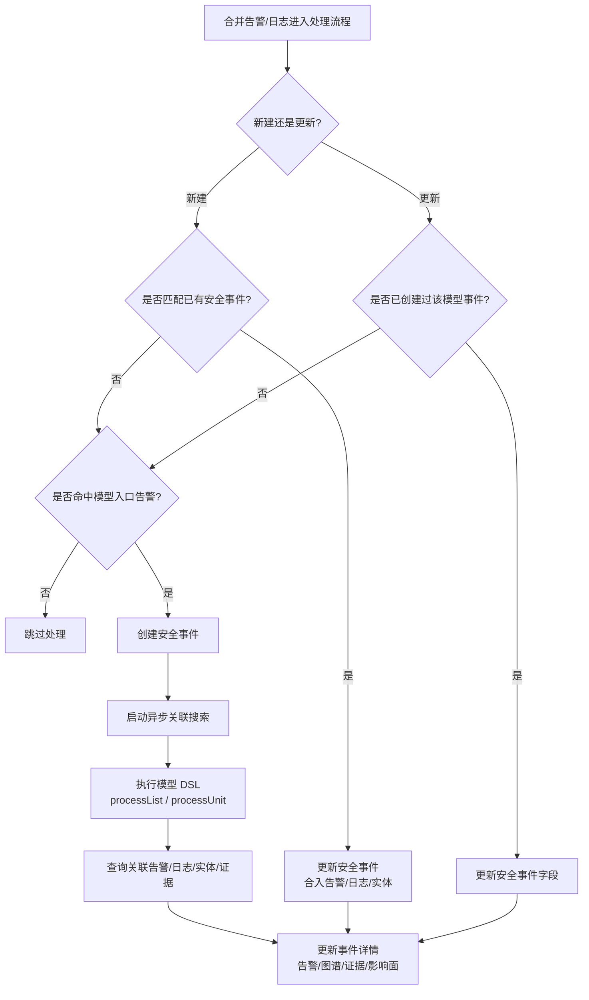
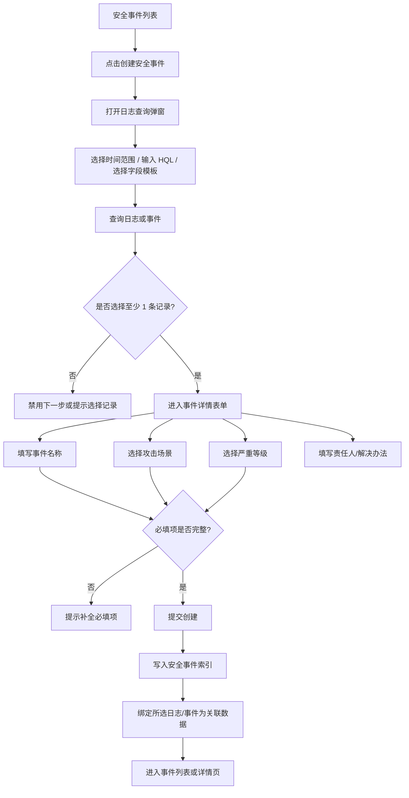
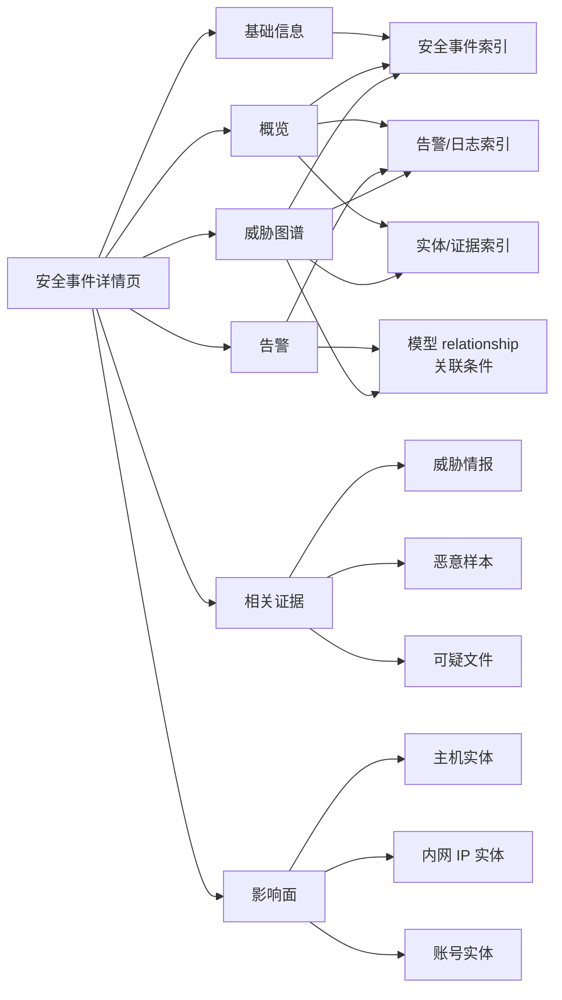
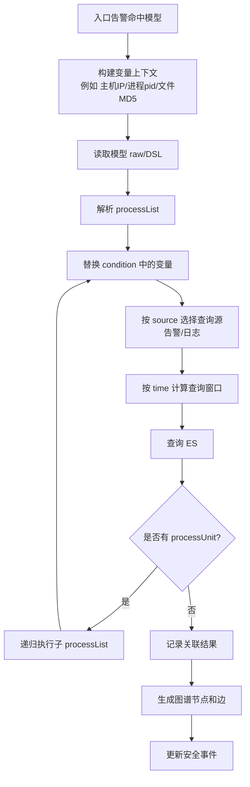

# 安全事件模型与安全事件架构图

## 1. 总体架构图

```mermaid
flowchart TB
  subgraph FE["Web 前端"]
    FE1["安全事件模型\n列表/新建/编辑/详情"]
    FE2["安全事件\n列表/筛选/创建"]
    FE3["安全事件详情\n概览/告警/图谱/证据/影响面"]
    FE4["HQL 日志查询\n字段模板/结果选择"]
  end

  subgraph API["安全事件后端服务 API"]
    API1["Model API\n模型 CRUD/启停/导入导出"]
    API2["Incident API\n事件列表/创建/编辑/详情"]
    API3["Search API\nHQL 日志检索/字段模板"]
    API4["Graph API\n威胁图谱/关系查询"]
    API5["Evidence API\n证据/影响面查询"]
  end

  subgraph PG["PostgreSQL 配置库"]
    PG1["ice_rule\n安全事件模型"]
    PG2["attack_scene\n攻击场景树"]
    PG3["ice_analysis_task\n异步分析任务"]
  end

  subgraph ES["Elasticsearch 检索存储"]
    ES1["incident_local_brain45_es7\n安全事件索引"]
    ES2["告警/合并告警索引"]
    ES3["日志索引"]
    ES4["实体/证据索引"]
  end

  subgraph MQ["Kafka 数据流"]
    K1["原始日志/事件 Topic"]
    K2["告警输出 Topic"]
    K3["安全事件任务 Topic"]
  end

  subgraph ENG["事件聚合与检测引擎"]
    E1["Flink Source\n消费 Kafka"]
    E2["HQL 表达式树\n规则匹配"]
    E3["入口告警判断\n命中模型"]
    E4["DSL 执行器\nprocessList/processUnit"]
    E5["异步关联搜索\n告警/日志/实体扩展"]
    E6["事件生成/更新\n幂等合并"]
  end

  subgraph CACHE["Redis / 缓存"]
    R1["白名单"]
    R2["富化信息"]
    R3["临时聚合状态"]
    R4["图谱中间结果"]
  end

  FE1 --> API1
  FE2 --> API2
  FE3 --> API2
  FE3 --> API4
  FE3 --> API5
  FE4 --> API3

  API1 --> PG1
  API1 --> PG2
  API2 --> ES1
  API2 --> ES2
  API2 --> PG2
  API3 --> ES3
  API4 --> ES1
  API4 --> ES2
  API4 --> ES4
  API5 --> ES4

  K1 --> E1
  E1 --> E2
  E2 --> E3
  E3 --> E4
  E4 --> E5
  E5 --> E6
  E6 --> ES1
  E6 --> K2

  PG1 -. "定时加载模型" .-> E3
  PG1 -. "加载 DSL" .-> E4
  PG3 -. "任务状态/进度" .-> E5
  E5 --> PG3

  E2 --> R1
  E3 --> R2
  E5 --> R3
  API4 --> R4

  API2 -. "人工创建事件" .-> ES1
  API2 -. "关联所选日志/告警" .-> ES2
  API2 -. "触发关联任务，可选" .-> K3
  K3 -.-> E5
```

## 2. 自动聚合生成安全事件流程

```mermaid
flowchart TD
  A["合并告警/日志进入处理流程"] --> B{"新建还是更新?"}

  B -->|新建| C{"是否匹配已有安全事件?"}
  C -->|是| D["更新安全事件\n合入告警/日志/实体"]
  C -->|否| E{"是否命中模型入口告警?"}
  E -->|否| F["跳过处理"]
  E -->|是| G["创建安全事件"]
  G --> H["启动异步关联搜索"]
  H --> I["执行模型 DSL\nprocessList / processUnit"]
  I --> J["查询关联告警/日志/实体/证据"]
  J --> K["更新事件详情\n告警/图谱/证据/影响面"]

  B -->|更新| L{"是否已创建过该模型事件?"}
  L -->|是| M["更新安全事件字段"]
  L -->|否| E

  D --> K
  M --> K
```

## 3. 人工创建安全事件流程

```mermaid
flowchart TD
  A["安全事件列表"] --> B["点击创建安全事件"]
  B --> C["打开日志查询弹窗"]
  C --> D["选择时间范围 / 输入 HQL / 选择字段模板"]
  D --> E["查询日志或事件"]
  E --> F{"是否选择至少 1 条记录?"}
  F -->|否| G["禁用下一步或提示选择记录"]
  F -->|是| H["进入事件详情表单"]
  H --> I["填写事件名称"]
  H --> J["选择攻击场景"]
  H --> K["选择严重等级"]
  H --> L["填写责任人/解决办法"]
  I --> M{"必填项是否完整?"}
  J --> M
  K --> M
  M -->|否| N["提示补全必填项"]
  M -->|是| O["提交创建"]
  O --> P["写入安全事件索引"]
  P --> Q["绑定所选日志/事件为关联数据"]
  Q --> R["进入事件列表或详情页"]
```

## 4. 安全事件详情数据聚合图

```mermaid
flowchart LR
  A["安全事件详情页"] --> B["基础信息"]
  A --> C["概览"]
  A --> D["告警"]
  A --> E["威胁图谱"]
  A --> F["相关证据"]
  A --> G["影响面"]

  B --> ES1["安全事件索引"]
  C --> ES1
  C --> ES2["告警/日志索引"]
  C --> ES4["实体/证据索引"]

  D --> ES2
  D --> REL["模型 relationship\n关联条件"]

  E --> ES1
  E --> ES2
  E --> ES4
  E --> REL

  F --> IOC["威胁情报"]
  F --> SAMPLE["恶意样本"]
  F --> FILE["可疑文件"]

  G --> HOST["主机实体"]
  G --> IP["内网 IP 实体"]
  G --> ACC["账号实体"]
```

## 5. 模型 DSL 执行图

```mermaid
flowchart TD
  A["入口告警命中模型"] --> B["构建变量上下文\n例如 主机IP/进程pid/文件MD5"]
  B --> C["读取模型 raw/DSL"]
  C --> D["解析 processList"]
  D --> E["替换 condition 中的变量"]
  E --> F["按 source 选择查询源\n告警/日志"]
  F --> G["按 time 计算查询窗口"]
  G --> H["查询 ES"]
  H --> I{"是否有 processUnit?"}
  I -->|是| J["递归执行子 processList"]
  J --> E
  I -->|否| K["记录关联结果"]
  K --> L["生成图谱节点和边"]
  L --> M["更新安全事件"]
```
